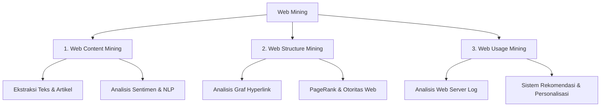

## Apa itu Web Mining?

**Web Mining** adalah penerapan teknik *data mining* (penambangan data) secara otomatis untuk menemukan, mengekstrak, dan menganalisis pola informasi yang berharga dari sekumpulan dokumen atau layanan berbasis web (*World Wide Web*).

Di era modern saat ini, World Wide Web telah menjadi repositori informasi terbesar di dunia. Karakteristik data web yang sangat masif, heterogen, semi-terstruktur (seperti dokumen HTML/XML), dan sangat dinamis menjadikan *web mining* sebagai bidang yang sangat esensial dalam disiplin ilmu komputasi dan sains data.

---

## Karakteristik Data Web

Data di web memiliki tantangan tersendiri dibandingkan dengan basis data relasional konvensional:

1. **Skala Sangat Besar (Massive Volume)**: Jumlah halaman web terus bertambah secara eksponensial setiap detiknya.
2. **Semi-Terstruktur (Semi-Structured)**: Sebagian besar data web disimpan dalam format HTML yang tidak memiliki skema kaku seperti database relasional.
3. **Dinamis & Cepat Berubah (Highly Dynamic)**: Informasi di web sering diperbarui, dihapus, atau dipindahkan dalam hitungan menit (seperti portal berita).
4. **Tingkat Kebisingan Tinggi (Noisy Data)**: Konten utama sering kali bercampur dengan iklan, navigasi, skrip analitik, dan tag presentasi.

---

## 3 Kategori Utama Web Mining

Secara umum, *Web Mining* diklasifikasikan ke dalam 3 domain utama:

### 1. Web Content Mining
Proses ekstraksi informasi dan pola pengetahuan dari konten aktual yang berada di dalam halaman web. Konten tersebut dapat berupa:
- Teks berita atau artikel
- Tabel dan daftar data
- Media visual (gambar dan video)

:::tip[Relevansi dengan Tugas Praktikum Kita]
Tugas penambangan berita Detikcom (Sport & Finance) yang kita kerjakan masuk ke dalam kategori **Web Content Mining**, di mana kita mengekstrak teks berita, tanggal terbit, dan judul dari halaman HTML berita online untuk selanjutnya dapat diolah lebih lanjut (misalnya untuk *text clustering*, *topic modeling*, atau analisis sentimen).
:::

### 2. Web Structure Mining
Fokus pada analisis struktur topologi dan keterhubungan (*inter-connectivity*) antar halaman web menggunakan model graf (node dan edge).
- **Node**: Mewakili halaman web.
- **Edge**: Mewakili *hyperlink* yang menghubungkan halaman satu ke halaman lainnya.

Contoh penerapan paling populer adalah algoritma **PageRank** oleh Google dan **HITS** (*Hyperlink-Induced Topic Search*) untuk menilai otoritas, popularitas, serta relevansi suatu situs web di mesin pencari.

### 3. Web Usage Mining
Penambangan data dari riwayat interaksi pengguna web yang terekam pada *web server logs*, *cookie*, atau sesi aplikasi web. Tujuannya adalah memahami perilaku (*user behavior*) pengguna:
- Jalur klik pengguna (*clickstream analysis*)
- Durasi kunjungan dan bounce rate
- Preferensi konten pengunjung

Penerapan utamanya sangat krusial dalam **sistem rekomendasi e-commerce** (misal: "Pengguna yang melihat produk ini juga membeli...") dan strategi personalisasi antarmuka pengguna.
