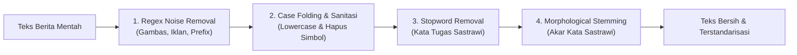

Tahap **Text Preprocessing** merupakan fondasi krusial dalam alur *Web Content Mining*. Teks berita mentah hasil scraping umumnya sarat dengan elemen *noise* (iklan, tag editorial, tanda baca, huruf kapital acak, serta kata sambung yang tidak bermakna diskriminatif).

---

## 1. Seleksi Data Representatif (Top-100 Berita Terpanjang)

Dari total 778 artikel hasil scraping (392 Detik Sport dan 386 Detik Finance), dilakukan seleksi berbasis panjang teks artikel (*word count*):

| Kategori Berita | Total Hasil Scraping | Jumlah Terpilih (Top-100) | Rentang Panjang Kata |
| :--- | :---: | :---: | :---: |
| **Detik Sport** | 392 artikel | **100 artikel** | 225 – 1.482 kata |
| **Detik Finance** | 386 artikel | **100 artikel** | 338 – 1.153 kata |
| **Total Korpus** | **778 artikel** | **200 artikel** | **Dataset Seimbang (Balanced 50:50)** |

### Alasan Pengambilan Top-100:
1. **Kekayaan Semantik Dokumen**: Artikel berita pendek sering kali hanya berisi pengumuman kilat atau foto dengan deskripsi minim. Dengan mengambil 100 artikel terpanjang, setiap dokumen memiliki kekayaan kosakata dan konteks tematik yang optimal.
2. **Keseimbangan Kelas (*Balanced Class*)**: Mencegah model klasifikasi mengalami bias terhadap kategori yang memiliki jumlah sampel lebih dominan.

---

## 2. Alur Pembersihan Bertahap (Noise Sanitization)

Pembersihan teks dilakukan secara berurutan menggunakan ekspresi reguler (*regex*) dan pustaka NLP **Sastrawi**:

### 2.1 Regex Noise Cleaning
Menghilangkan elemen struktural khas portal berita Detikcom yang tidak relevan dengan topik berita:
- **Tag Video & Widget Embed**: Menghapus pola `\[Gambas:.*?\]`.
- **Rekomendasi Redaksi**: Menghapus kalimat sisipan seperti `"Lihat juga Video: ..."` dan `"Baca juga: ..."`.
- **Prefix Kota & Wilayah**: Menghapus penanda lokasi berita di awal paragraf seperti `"Jakarta - "`, `"Surabaya - "`, atau `"Denpasar -"`.
- **Watermark Redaksi**: Menghapus identitas portal `"detikcom"`, `"detikSport"`, dan `"detikFinance"`.

### 2.2 Case Folding & Sanitasi Simbol
- Mengonversi semua huruf kapital menjadi huruf kecil (*lowercase*).
- Menghapus seluruh karakter numerik (angka `0-9`), tanda baca, dan karakter non-alfabet (`[^a-z\s]`).
- Menormalisasi spasi ganda menjadi spasi tunggal.

### 2.3 Stopword Removal
Menghapus kata-kata fungsional umum Bahasa Indonesia yang memiliki frekuensi tinggi namun minim informasi leksikal (seperti *yang, di, ke, dari, pada, untuk, adalah, ini, itu, dan, dengan*).

### 2.4 Stemming Bahasa Indonesia (Sastrawi)
Mengembalikan seluruh kata berimbuhan (awalan, akhiran, sisipan, dan apitan) ke bentuk kata dasarnya. 
- Contoh: *memenangkan* $\rightarrow$ **menang**, *keuangan* $\rightarrow$ **uang**, *dipertandingkan* $\rightarrow$ **tanding**.

---

## 3. Hasil & Rekapitulasi Reduksi Teks

Efektivitas pembersihan teks dapat diukur dari penurunan jumlah token keseluruhan serta penyusutan kosakata unik (*vocabulary*):

| Tahapan Preprocessing | Total Token Kata | Kosakata Unik (*Vocab*) | Reduksi Token | Reduksi Vocab |
| :--- | :---: | :---: | :---: | :---: |
| **1. Teks Asli (Raw Scraped)** | 104.889 | 9.674 | Baseline (0%) | Baseline (0%) |
| **2. Noise Cleaning & Case Folding** | 101.479 | 9.076 | -3,25% | -6,18% |
| **3. Stopwords & Stemming Sastrawi** | **79.781** | **6.486** | **-23,94%** | **-32,95%** |

> [!NOTE]
> Tahap stemming berhasil memangkas **3.188 variasi kata inflektif (-32,95%)**, menyederhanakan ruang fitur (*feature space*) secara signifikan sebelum proses pembobotan TF-IDF.

---

## 4. Unduh Dataset Hasil Preprocessing

Berkas hasil preprocessing lengkap berisi 200 artikel (100 Sport & 100 Finance) dengan atribut `judul`, `link`, `waktu`, `isi_berita` (yang sudah dibersihkan dan di-stem), serta `kategori`:

- 📥 [Unduh data_berita_processed.csv (567 KB)](/ppw/data/data_berita_processed.csv)
