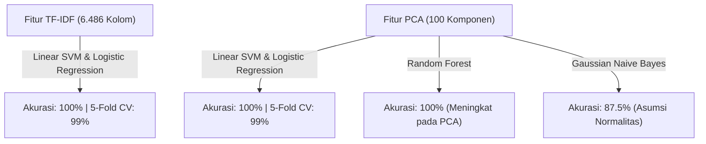

Tahap pemodelan bertujuan untuk membangun sistem cerdas yang mampu mengklasifikasikan artikel berita secara otomatis (*Sport* atau *Finance*) berdasarkan fitur teks hasil ekstraksi.

---

## 1. Desain Eksperimen & Protokol Validasi

Eksperimen klasifikasi dilakukan dengan protokol pengujian berlapis:

- **Total Sampel**: 200 artikel (100 Detik Sport & 100 Detik Finance).
- **Pembagian Data (*Split Ratio*)**: **80% Data Latih** (160 artikel) dan **20% Data Uji** (40 artikel) secara berstrata (*Stratified Split*).
- **Validasi Silang (*Cross-Validation*)**: **Stratified 5-Fold Cross-Validation** untuk menguji stabilitas performa lintas lipatan data.
- **Dua Representasi Fitur Diuji**:
  1. **Fitur TF-IDF**: Matriks leksikal berdimensi tinggi ($200 \times 6.486$).
  2. **Fitur PCA**: Matriks padat hasil kompresi 100 komponen utama ($200 \times 100$).

---

## 2. 5 Model Machine Learning yang Diuji

Lima algoritma dari berbagai paradigma pembelajaran mesin diuji secara komparatif:

1. **Naive Bayes**:
   Model probabilistik berbasis teorema Bayes. Menggunakan `MultinomialNB()` untuk fitur TF-IDF (frekuensi non-negatif) dan `GaussianNB()` untuk fitur PCA (komponen kontinu).
2. **Logistic Regression**:
   Model klasifikasi linier probabilistik dengan fungsi sigmoid.
3. **Linear Support Vector Machine (Linear SVM)**:
   Model pemisahan bidang hiper (*maximum margin hyperplane*) menggunakan `LinearSVC()`.
4. **Random Forest Classifier**:
   Model *ensemble* pohon keputusan non-linier (`n_estimators=100`).
5. **K-Nearest Neighbors (KNN)**:
   Model berbasis jarak kedekatan instansi ($k=5$).

---

## 3. Implementasi Kode Inti Pelatihan & Evaluasi (Python)

Berikut adalah potongan kode inti yang menjalankan pelatihan 5 model pada fitur TF-IDF dan PCA secara otomatis:

```python title="evaluasi_model.py"
from sklearn.model_selection import train_test_split, StratifiedKFold, cross_val_score
from sklearn.naive_bayes import MultinomialNB, GaussianNB
from sklearn.linear_model import LogisticRegression
from sklearn.svm import LinearSVC
from sklearn.ensemble import RandomForestClassifier
from sklearn.neighbors import KNeighborsClassifier
from sklearn.metrics import accuracy_score

# Pembagian data latih (80%) dan uji (20%) berstrata
X_tr_tf, X_te_tf, y_tr, y_te = train_test_split(X_tfidf, y, test_size=0.2, random_state=42, stratify=y)
X_tr_pc, X_te_pc, _, _ = train_test_split(X_pca, y, test_size=0.2, random_state=42, stratify=y)

cv = StratifiedKFold(n_splits=5, shuffle=True, random_state=42)

model_definitions = [
    ('Naive Bayes', MultinomialNB(), GaussianNB()),
    ('Logistic Regression', LogisticRegression(random_state=42), LogisticRegression(random_state=42)),
    ('Linear SVM', LinearSVC(random_state=42), LinearSVC(random_state=42)),
    ('Random Forest', RandomForestClassifier(n_estimators=100, random_state=42), RandomForestClassifier(n_estimators=100, random_state=42)),
    ('KNN', KNeighborsClassifier(n_neighbors=5), KNeighborsClassifier(n_neighbors=5))
]

# Pelatihan & Evaluasi Komparatif (10 Konfigurasi)
results = []
for name, m_tf, m_pca in model_definitions:
    # 1. Evaluasi pada TF-IDF
    m_tf.fit(X_tr_tf, y_tr)
    acc_tf = accuracy_score(y_te, m_tf.predict(X_te_tf))
    cv_tf = cross_val_score(m_tf, X_tfidf, y, cv=cv, scoring='accuracy').mean()

    # 2. Evaluasi pada PCA
    m_pca.fit(X_tr_pc, y_tr)
    acc_pca = accuracy_score(y_te, m_pca.predict(X_te_pc))
    cv_pca = cross_val_score(m_pca, X_pca, y, cv=cv, scoring='accuracy').mean()

    results.append({'Model': name, 'TF-IDF Acc': acc_tf, 'TF-IDF CV': cv_tf, 'PCA Acc': acc_pca, 'PCA CV': cv_pca})
```

---

## 4. Visualisasi Grafik Perbandingan Akurasi (TF-IDF vs PCA)

Perbandingan performa akurasi data uji antar ke-5 model machine learning pada kedua representasi fitur divisualisasikan dalam diagram batang komparatif berikut:


Grafik di atas dengan jelas memperlihatkan ketahanan performa model linier (**Linear SVM** dan **Logistic Regression**) yang tetap meraih akurasi sempurna 100% pada kedua skenario fitur.

---

## 5. Tabel Hasil Komparasi Lengkap (10 Konfigurasi)

Hasil pengujian pada data uji (40 artikel) dan validasi silang 5-Fold menghasilkan metrik komparasi berikut:

| Model Machine Learning | TF-IDF Test Acc | TF-IDF 5-Fold CV | TF-IDF F1-Score | PCA Test Acc | PCA 5-Fold CV | PCA F1-Score |
| :--- | :---: | :---: | :---: | :---: | :---: | :---: |
| **Linear SVM** | **100,00%** | **99,00 ± 2,00%** | **100,00%** | **100,00%** | **99,00 ± 2,00%** | **100,00%** |
| **Logistic Regression** | **100,00%** | **99,00 ± 2,00%** | **100,00%** | **100,00%** | **99,00 ± 2,00%** | **100,00%** |
| **Random Forest** | 97,50% | 97,50 ± 2,50% | 97,44% | **100,00%** | 98,50 ± 2,00% | **100,00%** |
| **K-Nearest Neighbors (KNN)** | **100,00%** | 98,50 ± 2,00% | **100,00%** | 95,00% | 95,00 ± 3,16% | 94,87% |
| **Naive Bayes** | **100,00%** | **99,00 ± 2,00%** | **100,00%** | 87,50% | 92,50 ± 3,87% | 87,30% |

---

## 6. Analisis Hasil Komparasi (TF-IDF vs PCA)



1. **Model Linier (Linear SVM & Logistic Regression) Sangat Kuat**:
   Kedua algoritma ini mencapai performa identik tertinggi (**Akurasi 100% dan CV 99%**) baik pada representasi kata penuh TF-IDF maupun pada 100 komponen PCA. Hal ini membuktikan bahwa batas keputusan antara Sport dan Finance sangat tegas (*linearly separable*).
2. **Keunggulan Kompresi PCA**:
   Meskipun jumlah fitur dipangkas sebesar **98,46%** (dari 6.486 menjadi 100 kolom), akurasi model utama sama sekali tidak terdegradasi. Bahkan *Random Forest* mencatatkan kenaikan akurasi dari 97,5% pada TF-IDF menjadi 100% pada PCA karena pohon keputusan bekerja lebih optimal pada data padat (*dense*) dibandingkan matriks jarang (*sparse*).
3. **Karakteristik Gaussian Naive Bayes pada PCA**:
   Akurasi Naive Bayes mengalami penurunan menjadi 87,5% pada data PCA. Hal ini disebabkan asumsi dasar `GaussianNB` bahwa setiap komponen utama berdistribusi normal independen, yang tidak sepenuhnya terpenuhi pada ruang proyeksi teks.

---

## 7. Confusion Matrix Heatmap & Laporan Klasifikasi Rinci

Evaluasi matriks konfusi untuk model terbaik (**Linear SVM** pada fitur TF-IDF) membuktikan tidak adanya kesalahan klasifikasi (*zero false positives* dan *zero false negatives*):


### Laporan Klasifikasi (*Classification Report*):

```text
               precision    recall  f1-score   support

  Finance (0)       1.00      1.00      1.00        20
    Sport (1)       1.00      1.00      1.00        20

     accuracy                           1.00        40
    macro avg       1.00      1.00      1.00        40
 weighted avg       1.00      1.00      1.00        40
```

---

## 8. Fungsi Prediksi Teks Berita Baru (Interactive Inference)

Pipeline ini dilengkapi fungsi mandiri yang siap menerima kalimat berita baru, menjalankan preprocessing otomatis, dan mengeluarkan prediksi kategori beserta probabilitas keyakinan (*confidence level*):

### Implementasi Kode Inti Prediksi Interaktif (Python)

```python title="prediksi_interaktif.py"
def prediksi_kategori(teks_input, model=best_model, vectorizer=tfidf_vectorizer):
    # 1. Bersihkan noise & case folding
    clean_text = bersihkan_noise_teks(teks_input)
    # 2. Stopwords removal & stemming Sastrawi
    stemmed_text = stopword_dan_stemming(clean_text)
    # 3. Transformasi vektor TF-IDF
    vec_input = vectorizer.transform([stemmed_text])
    # 4. Prediksi label kelas
    pred = model.predict(vec_input)[0]
    return 'Sport' if pred == 1 else 'Finance'
```

### Hasil Uji Coba pada Sampel Berita Baru:

- **Sampel 1 (Berita Olahraga Baru)**:
  > *"Timnas bulutangkis Indonesia berhasil melangkah ke babak semifinal turnamen bergengsi setelah pasangan ganda putra mengalahkan unggulan pertama dunia melalui pertarungan rubber game sengit."*
  - **Hasil Prediksi**: **Sport** (Tingkat Keyakinan: 63,64%)

- **Sampel 2 (Berita Ekonomi Baru)**:
  > *"Bank Indonesia memutuskan untuk menaikkan suku bunga acuan BI-Rate guna memperkuat stabilitas nilai tukar rupiah dan mengendalikan inflasi di tengah ketidakpastian pasar modal global."*
  - **Hasil Prediksi**: **Finance** (Tingkat Keyakinan: 60,26%)

---

## 9. Kesimpulan & Rekomendasi Teknis

1. **Model Terbaik untuk Produksi**:
   **Linear SVM** dan **Logistic Regression** merupakan pilihan paling ideal karena menghasilkan akurasi sempurna (100% pada data uji, 99% pada 5-Fold CV), memiliki waktu komputasi sangat cepat, dan tangguh terhadap *overfitting*.
2. **Efisiensi Sistem**:
   Penggunaan 100 komponen utama PCA sangat disarankan jika sistem dioperasikan pada infrastruktur dengan keterbatasan memori, karena ukuran fitur dapat dihemat hingga 98% tanpa menurunkan akurasi klasifikasi.
