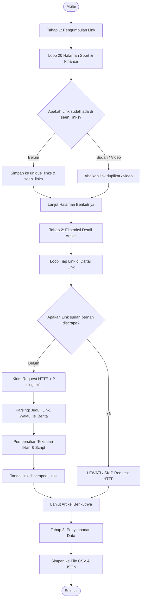

## Gambaran Umum Proyek

Proyek ini bertujuan untuk melakukan penambangan data (*Web Content Mining*) pada situs portal berita terkemuka di Indonesia, yaitu **Detik.com**, khususnya pada dua kanal berita:
1. **Detik Sport**: `https://sport.detik.com/indeks`
2. **Detik Finance**: `https://finance.detik.com/indeks`

Setiap kanal diambil sebanyak **20 halaman indeks (*pagination*)**, dengan estimasi ~20 artikel per halaman, sehingga total potensi data yang dikumpulkan berkisar antara 700 hingga 800 artikel berita.

---

## 4 Atribut Data Target

Sesuai dengan kebutuhan tugas, hasil ekstraksi dibatasi dan distandarkan menjadi **4 atribut utama**:

| No | Atribut | Tipe Data | Deskripsi |
| :---: | :--- | :--- | :--- |
| 1 | `judul` | String | Judul lengkap artikel berita |
| 2 | `link` | String (URL) | Alamat tautan permanen (*canonical URL*) artikel berita |
| 3 | `waktu` | String | Waktu dan tanggal publikasi artikel (misal: *Senin, 14 Sep 2026 11:50 WIB*) |
| 4 | `isi_berita` | String (Text) | Keseluruhan teks isi berita yang telah dibersihkan dari noise iklan |

---

## Alur Kerja Scraping (3 Tahap)

Proses penambangan berita dirancang secara sistematis ke dalam 3 tahapan:



---

## Mekanisme Anti-Duplikasi (*Zero Redundant Scraping*)

Salah satu keunggulan utama dari kode scraper ini adalah perlindungan anti-duplikasi ganda:

1. **Deduplikasi Tahap Pengumpulan Link (Tahap 1)**:
   Situs berita sering kali memuat artikel yang sama di lebih dari satu halaman pagination. Untuk mencegah link ganda, digunakan struktur data `set` (`seen_links`). Link yang sudah ada di dalam `set` tidak akan dimasukkan ulang.
   
2. **Deduplikasi Tahap Scraping Detail Artikel (Tahap 2)**:
   Sebelum mengirim request HTTP ke sebuah link artikel, script mengecek apakah link tersebut sudah ada dalam `scraped_links`:
   ```python
   if url in scraped_links:
       print(f"[{idx}/{total}] [SKIP] Link sudah pernah discrape: {url}")
       continue
   ```
   Hal ini menjamin bahwa **tidak ada proses request HTTP yang dilakukan 2x pada link yang sama**, menghemat bandwidth, waktu eksekusi, serta mencegah IP terblokir oleh server Detik.

---

## Penanganan Khusus Elemen Detik.com

### 1. Artikel Multi-Halaman (`?single=1`)
Detik.com kerap membagi satu artikel panjang ke dalam beberapa halaman (`page=1`, `page=2`). Untuk mengatasi hal ini, script secara otomatis menyematkan parameter `?single=1` saat melakukan request detail, sehingga konten artikel langsung dimuat utuh dalam satu halaman HTML.

### 2. Pembersihan *Noise* & Boilerplate Iklan
Untuk menghasilkan teks yang bersih dan siap diolah dalam NLP/Text Mining, script melakukan pembersihan:
- Menghapus tag script, styling, iframe, dan tabel: `script`, `style`, `iframe`, `table`, `figure`.
- Menghapus tag promosi: `linkbaca`, `detail__body-tag`, `inner-linkbaca`, `sisip_video_inarticle`, `advertisement`.
- Membuang kalimat boilerplate seperti `"SCROLL TO CONTINUE WITH CONTENT"`, `"ADVERTISEMENT"`, dan widget `"Simak Video"`.
